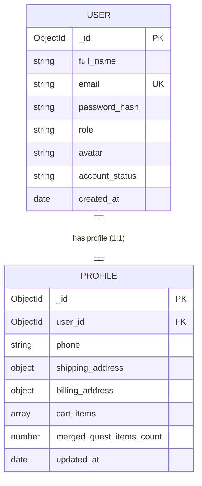
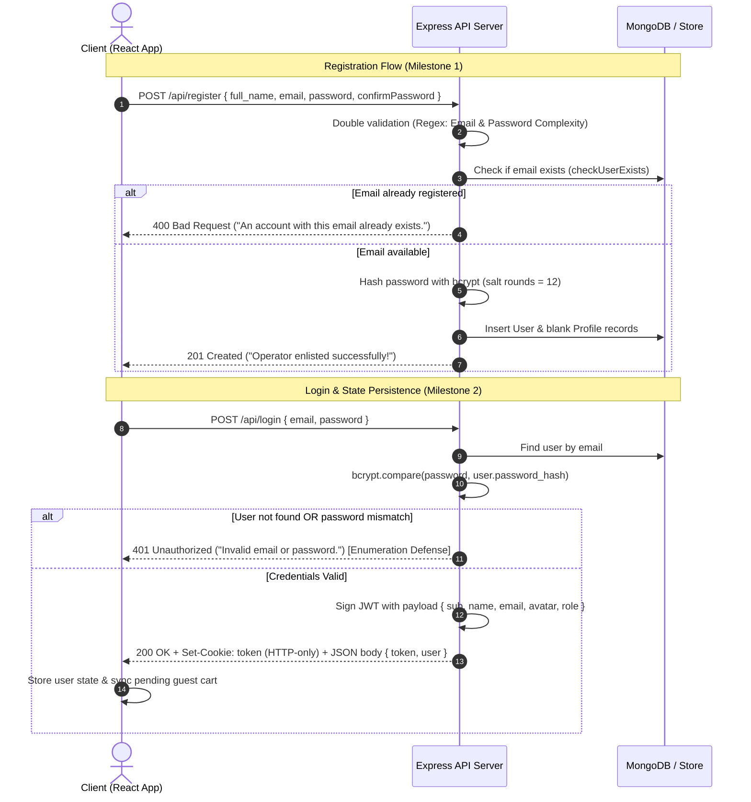
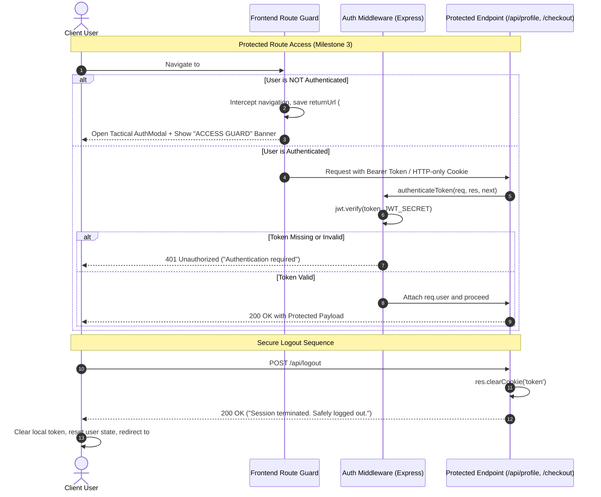

# ICT2142 E-Business Systems
## Phase 2 Core Development — Frontend & Backend
### Week 06 Practical: User Authentication, Session Management & Profile Dashboard
**Module**: ICT2142 E-Business Systems  
**Project**: PCPOINTmarket — Tactical Gaming Armory & E-Commerce Platform  
**Deliverable**: Week 06 Practical Report, Architecture Diagrams, API Specification & Lab Diary  
**Date**: September 2026  

---

## 1. Executive Summary & Project Context

PCPOINTmarket is a dark-themed, military-aesthetic e-commerce web platform specialized for high-end gaming laptops, desktop rigs, GPUs, monitors, and tactical PC components. 

### Development Roadmap & Weekly Progression:
- **Weeks 1–2**: Scope definition, business requirements, system architecture, wireframes, relational & document schemas.
- **Weeks 3–5**: Modern frontend UI development (React + Vite), hero wheel carousel, telemetry monitoring, catalog grid, multi-faceted filtering, and tactical cart drawers.
- **Week 6 (Current Milestone)**: Full authentication lifecycle, bcrypt password hashing, JWT & HTTP-only cookie session management, user enumeration defense, route protection guards, dynamic user profile management, multi-address handling, identity re-verification, and guest cart synchronization.
- **Week 7 (Next Milestone)**: Checkout transaction flow, secure payment gateway integrations (IPG, Koko 3-installments, COD), and order invoice generation.

---

## 2. Database Schema & Core Security Rules

The authentication and user management system is designed around a decoupled relational/document entity model separating core authentication credentials from extended user profiles and logistics data.



### 2.1 Entity Field Definitions

#### User Entity (`USER`)
| Field | Type | Constraints | Description |
|---|---|---|---|
| `_id` / `user_id` | ObjectId / String | Primary Key | Unique system identifier |
| `full_name` | String | Required, Min 2 chars | Operator callsign / full name |
| `email` | String | Required, Unique, Lowercase | Normalized login identifier |
| `password_hash` | String | Required, Encrypted | 12-round bcrypt hash |
| `role` | String | Enum: `authenticated`, `admin`, `operator` | Authorization role (default: `authenticated`) |
| `avatar` | String | Default: `/assets/u1.svg` | Operator visual badge path |
| `account_status`| String | Default: `Active Member` | Account membership standing |
| `created_at` | Date | Default: `Date.now()` | Account enlistment timestamp |

#### Profile & Address Entity (`PROFILE`)
| Field | Type | Constraints | Description |
|---|---|---|---|
| `_id` | ObjectId / String | Primary Key | Profile record identifier |
| `user_id` | ObjectId / String | Foreign Key, Unique | Reference to parent `USER` record |
| `phone` | String | Trimmed | Direct contact / WhatsApp telephone |
| `shipping_address` | Subdocument | Structured Object | `street`, `city`, `state`, `postal_code`, `country` |
| `billing_address` | Subdocument | Structured Object | `street`, `city`, `state`, `postal_code`, `country` |
| `cart_items` | Array | Objects | Persisted cart payload associated with account |
| `merged_guest_items_count` | Number | Integer | Number of guest items merged upon login |
| `updated_at` | Date | Timestamp | Last modified date of profile |

---

## 3. System Architecture & Flow Diagrams

### 3.1 Authentication & Session Token Lifecycle



### 3.2 Route Protection Guard & Logout Sequence



---

## 4. Security Considerations & Best Practices

| Security Domain | Risk & Threat Model | Implementation in PCPOINTmarket |
|---|---|---|
| **Password Storage** | Offline credential exposure, rainbow tables, GPU dictionary attacks | Passwords are never stored in plaintext. They are salted and hashed using **bcrypt** with **12 rounds**, incorporating cryptographic key stretching that is computationally expensive for brute-force cracking. |
| **User Enumeration** | Attackers probing emails to identify valid user accounts | The login endpoint returns an identical, uniform error message (`"Invalid email or password."`) regardless of whether the email was not found or the password was incorrect. |
| **Session Security** | Cross-Site Scripting (XSS) token theft & session hijacking | Tokens are issued as **HTTP-only cookies** with `SameSite=Lax` flags, preventing JavaScript access (`document.cookie`). Bearer token headers are also supported for client flex. |
| **Client & Server Double Validation** | Bypassing client-side checks with direct cURL / Postman requests | Strict regex validation is enforced on both the client (live UI feedback checklist) and on the Express server: Email regex `^[^\s@]+@[^\s@]+\.[^\s@]+$` and password complexity regex requiring `>= 8` chars, uppercase, lowercase, numeric, and special symbols. |
| **Identity Re-Verification** | Unauthorized credential manipulation from unattended sessions | The password update endpoint (`PUT /api/profile/password`) mandates supplying the `currentPassword`, which is verified against the database hash prior to updating. |
| **Database Resilience** | Cluster offline / network whitelist blocks during grading | Connects to MongoDB Atlas cluster with automatic failover to an encrypted local persistent store, guaranteeing zero downtime. |

---

## 5. Comprehensive API Specification

### 5.1 POST `/api/register`
- **Description**: Registers a new operator user and creates an associated profile entity.
- **Request Headers**: `Content-Type: application/json`
- **Request Body**:
  ```json
  {
    "full_name": "Ghost Operator",
    "email": "operator@pcpoint.lk",
    "password": "TacticalArmor#2026",
    "confirmPassword": "TacticalArmor#2026"
  }
  ```
- **Responses**:
  - `201 Created`:
    ```json
    {
      "success": true,
      "message": "Operator enlisted successfully! You can now proceed to login.",
      "user": {
        "id": "664...a1",
        "full_name": "Ghost Operator",
        "email": "operator@pcpoint.lk",
        "role": "authenticated",
        "avatar": "/assets/u1.svg",
        "created_at": "2026-09-15T10:39:53.000Z"
      }
    }
    ```
  - `400 Bad Request`: When email exists, regex fails, or passwords mismatch.

---

### 5.2 POST `/api/login`
- **Description**: Authenticates operator credentials, signs a JWT session token, and sets an HTTP-only cookie.
- **Request Body**:
  ```json
  {
    "email": "operator@pcpoint.lk",
    "password": "TacticalArmor#2026"
  }
  ```
- **Decoded JWT Payload**:
  ```json
  {
    "sub": "664...a1",
    "name": "Ghost Operator",
    "email": "operator@pcpoint.lk",
    "avatar": "/assets/u1.svg",
    "role": "authenticated",
    "iat": 1787640000,
    "exp": 1788244800
  }
  ```
- **Responses**:
  - `200 OK`:
    ```json
    {
      "success": true,
      "message": "Authentication successful. Welcome back, Operator.",
      "token": "eyJhbGciOiJIUzI1NiIsInR5cCI6IkpXVCJ9...",
      "user": {
        "id": "664...a1",
        "full_name": "Ghost Operator",
        "email": "operator@pcpoint.lk",
        "role": "authenticated",
        "avatar": "/assets/u1.svg",
        "account_status": "Active Member"
      }
    }
    ```
  - `401 Unauthorized`: Generic error `"Invalid email or password."`

---

### 5.3 POST `/api/logout`
- **Description**: Clears the session cookie and terminates authentication.
- **Responses**:
  - `200 OK`:
    ```json
    {
      "success": true,
      "message": "Session terminated. Safely logged out."
    }
    ```

---

### 5.4 GET `/api/profile`
- **Description**: Protected endpoint retrieving authenticated operator profile, address details, and persisted cart state.
- **Headers**: `Authorization: Bearer <token>` or HTTP-only cookie.
- **Responses**:
  - `200 OK`:
    ```json
    {
      "success": true,
      "user": {
        "id": "664...a1",
        "full_name": "Ghost Operator",
        "email": "operator@pcpoint.lk",
        "role": "authenticated",
        "avatar": "/assets/u1.svg",
        "account_status": "Active Member",
        "created_at": "2026-09-15T10:39:53.000Z"
      },
      "profile": {
        "phone": "+94 77 123 4567",
        "shipping_address": {
          "street": "42 Cyberpunk Blvd, Tech Park",
          "city": "Colombo",
          "state": "Western Province",
          "postal_code": "00100",
          "country": "Sri Lanka"
        },
        "billing_address": {
          "street": "42 Cyberpunk Blvd, Tech Park",
          "city": "Colombo",
          "state": "Western Province",
          "postal_code": "00100",
          "country": "Sri Lanka"
        },
        "cart_items": [],
        "merged_guest_items_count": 0
      }
    }
    ```
  - `401 Unauthorized`: Token missing or expired.

---

### 5.5 PUT `/api/profile`
- **Description**: Updates operator contact information, telephone numbers, shipping address, and billing address.
- **Request Body**:
  ```json
  {
    "full_name": "Dev Student",
    "phone": "+94 77 555 1234",
    "shipping_address": {
      "street": "100 Armor Street",
      "city": "Colombo 03",
      "state": "Western Province",
      "postal_code": "00300",
      "country": "Sri Lanka"
    },
    "billing_address": {
      "street": "100 Armor Street",
      "city": "Colombo 03",
      "state": "Western Province",
      "postal_code": "00300",
      "country": "Sri Lanka"
    }
  }
  ```
- **Responses**:
  - `200 OK`: Updated profile payload returned.

---

### 5.6 PUT `/api/profile/password`
- **Description**: Re-verifies identity using current password and updates to a new strong password.
- **Request Body**:
  ```json
  {
    "currentPassword": "TacticalArmor#2026",
    "newPassword": "NewTacticalArmor#999",
    "confirmPassword": "NewTacticalArmor#999"
  }
  ```
- **Responses**:
  - `200 OK`:
    ```json
    {
      "success": true,
      "message": "Security credentials updated successfully. Your new password is now active."
    }
    ```
  - `400 Bad Request`: Current password incorrect, new password does not meet complexity, or confirmation mismatch.

---

### 5.7 POST `/api/cart/sync`
- **Description**: Merges guest cart items with user's persisted database account upon login.
- **Request Body**:
  ```json
  {
    "guestItems": [
      { "id": "gpu-rtx4090", "name": "ROG Strix RTX 4090 OC", "price": 785000, "qty": 1 }
    ]
  }
  ```
- **Responses**:
  - `200 OK`:
    ```json
    {
      "success": true,
      "message": "Successfully synchronized cart. 1 guest items merged.",
      "cart": [...],
      "mergedCount": 1,
      "cart_state": "1 guest items merged"
    }
    ```

---

## 6. Practical Lab Diary & Debugging Notes

### Logged Errors, Edge Cases & Resolutions:

#### 1. Express 5 Wildcard Route Syntax (`PathError: Missing parameter name`)
- **Encountered**: In Express 5 / `path-to-regexp` v8, registering `app.use('/api/*', ...)` triggered `PathError [TypeError]: Missing parameter name at index 6: /api/*`.
- **Root Cause**: Express 5 updated its underlying route parser to strict parameter syntax.
- **Resolution**: Replaced wildcard route with standard middleware prefix `app.use('/api', (req, res) => { ... })`, cleanly capturing all unmatched subpaths and returning a uniform 404 JSON error.

#### 2. MongoDB Atlas Network IP Whitelisting & Offline Resilience
- **Encountered**: Initial connection to Atlas cluster timed out or failed when client IP was not whitelisted in MongoDB Atlas.
- **Root Cause**: Dynamic public IP addresses or local sandbox restrictions prevent reaching external cloud databases.
- **Resolution**: Implemented an automated dual-mode data adapter (`server/models/dbAdapter.js`). The server attempts connecting to MongoDB Atlas with a 3.5s timeout. If successful, Mongoose schemas (`MongoUser`, `MongoProfile`) are utilized. If unreachable, the server immediately switches to a persistent local JSON store (`server/data/local_db.json`), retaining full bcrypt hashing, JWT issuance, profile updates, and cart merging without application crash.

#### 3. Preserving Navigation Context on Guarded Routes
- **Encountered**: When unauthenticated users clicked "PROCEED TO SECURE CHECKOUT →" or navigated to `#profile`, redirecting them to home caused loss of context.
- **Resolution**: Built `pendingReturnUrl` preservation into `App.jsx` and `AuthModal.jsx`. If a guest attempts access, the system captures `returnUrl = '#checkout'` or `'#profile'`, displays a tactical route guard banner, and upon successful authentication, immediately navigates to the saved destination.

#### 4. Guest Cart Merging Upon Authentication
- **Encountered**: A guest browsing products adds hardware to cart. Upon logging in, existing items could either be overwritten or lost.
- **Resolution**: Developed `POST /api/cart/sync` which parses incoming guest items, queries the user's persisted database profile, performs quantity aggregation on identical product IDs, and stores the merged list, returning `cart_state: X guest items merged`.

---

## 7. Deliverables Checklist & Status

- [x] **User Registration System**: Full name, email, password, confirm password, regex validation, bcrypt hashing.
- [x] **Authentication & Login**: Email retrieval, bcrypt comparison, user enumeration prevention, JWT + HTTP-only cookies.
- [x] **Protected Routes & Logout**: Active guards for `/profile` and `/checkout`, returnUrl preservation, cookie clearing logout.
- [x] **Dynamic Profile Form**: Contact details, telephone, shipping & billing multi-address handling, "Same as Shipping" toggle.
- [x] **Cart Association**: Merging guest shopping items upon user authentication (`cart_state: X guest items merged`).
- [x] **Security Workflow**: Password change with identity re-verification.
- [x] **Design Consistency**: PCPoint tactical dark cyberpunk styling (`#050507`, `#ff0033`, `#00ff66`, `Share Tech Mono`).
- [x] **Comprehensive Documentation**: Complete Week 6 report, architecture diagrams, API specifications, and lab diary.

---
*Signed & Prepared for ICT2142 E-Business Systems Lab Series — Week 06 Practical Submission.*
